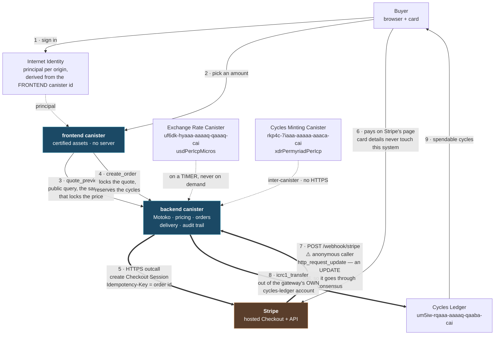

# Architecture

One Motoko backend canister and one certified-assets frontend canister. **There is no
server** — no API tier, no database, no queue, no cron host. Pricing, payment
orchestration, delivery and the audit trail all execute on-chain.

The diagram is the point of this page: where the trust boundaries are, and which of the
two cycle pots a delivery spends from.

`==>` is a trust boundary being crossed. `-.->` is an on-chain read with no off-chain
dependency. The **XRC, CMC and cycles-ledger ids are protocol constants** and are in the
code (`Xrc.mo`, `Cmc.mo`, `Delivery.mo`); this deployment's own two ids are in
`.icp/data/mappings/ic.ids.json`, deliberately not written here — a diagram that names
one deployment is wrong for every other one.

## The four things the diagram exists to make unmissable

**1. The webhook's caller is anonymous, and the HMAC is the entire trust root.** The
boundary node terminates TLS, so nothing about the transport authenticates Stripe.
`HMAC-SHA256` over `timestamp.body` with the signing secret is all of it — whoever holds
that secret can sign a completed-payment event for an order they created and be delivered
cycles having paid nothing. That is why the reserve balance is the blast radius, and why
sizing it is a security decision (`RUNBOOK.md`'s webhook-secret section).

**2. Step 7 is an UPDATE call.** `http_request_update`, not `http_request` — so the
webhook goes through consensus and can write state. The name suggests otherwise, and it
is the reason the handler can deliver at all.

**3. Pricing crosses no trust boundary.** Both rates come from *canisters* — the XRC for
USD/ICP, the CMC for XDR/ICP — read on a timer. There are exactly **three** HTTPS outcalls
in the whole system and all three go to Stripe: create a session, expire a session, and
retrieve one (the recovery sweep). "A canister that talks to a payment processor" makes
people assume a price oracle over HTTP; there isn't one.

⚠️ **ICP cancels out of the price.** Both rates are *per ICP*, so their quotient is XDR per
USD and the ICP price drops out entirely. A cycle is XDR-pegged, and the gateway carries
no ICP exposure per order — it holds no ICP at all.

**4. There are two cycle pots, and confusing them is this system's most common
operational error.**

| | what it is | funded by | spent on |
|---|---|---|---|
| **the reserve** | the backend's own **cycles-ledger account** | `icp cycles transfer <amount> <backend-principal>` | delivery to buyers, via `icrc1_transfer` |
| **the canister's gas** | the backend canister's own cycle balance | `icp canister top-up backend --amount` | execution, the three outcalls, 1 B per XRC rate refresh |

`icp canister top-up` does **not** touch the reserve. And a funded reserve is not a
*sellable* one until `refresh_reserve` runs: solvency is decided against a maintained
lower bound that starts at zero and only rises by observation.

## One invariant enforced by a type, not a check

`src/backend/Delivery.mo` declares the cycles-ledger interface the canister may call, and
**`icrc2_approve` and the ledger's `withdraw` are absent from it**. They therefore cannot
be called, which is what makes `Reserve.mo`'s floor a valid lower bound: the balance
cannot fall except when this canister transfers out. `scripts/test-all.sh` fails the gate
on a declaration that widens that interface.

That shape — an invariant held by an omission plus a gate step, rather than by a runtime
guard — is worth knowing before changing anything in that file.

## Where to go next

| | |
|---|---|
| **why** it is built this way | `docs/DESIGN.md` — the decision record, and what the `§N` comments in the code point at |
| the Card rail in full detail | `docs/STRIPE.md` — ingress, signature verification, attribution, dedup, the order lifecycle, refunds |
| running or deploying it | `docs/OPERATE.md` — one procedure per mode |
| operating it when something breaks | `RUNBOOK.md` — entered by symptom |
